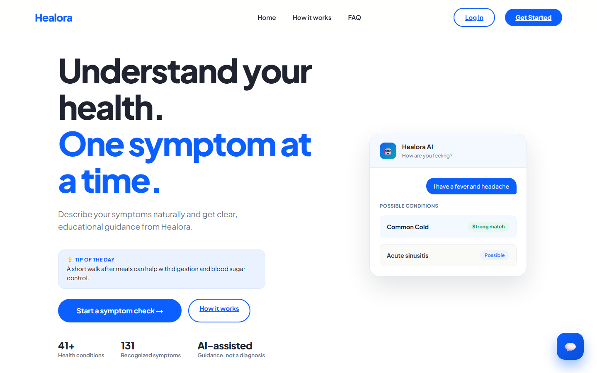
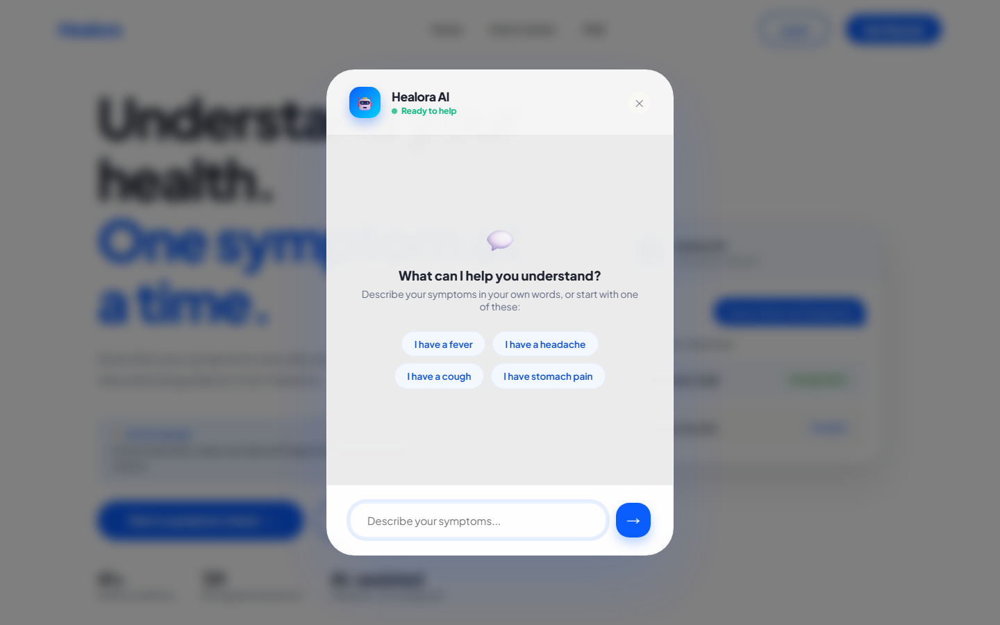
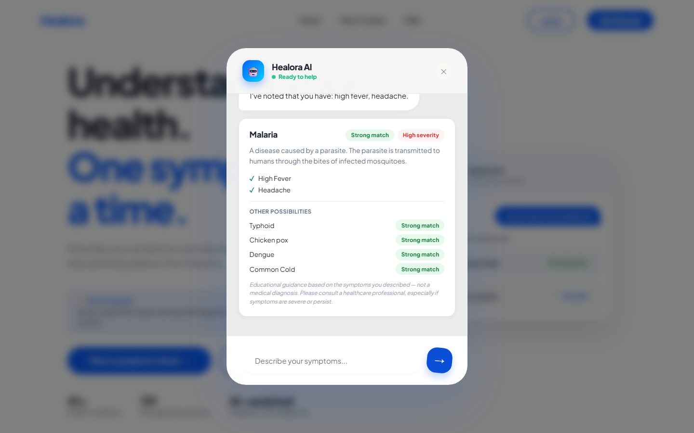
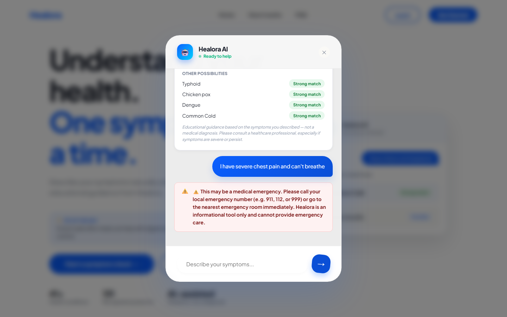
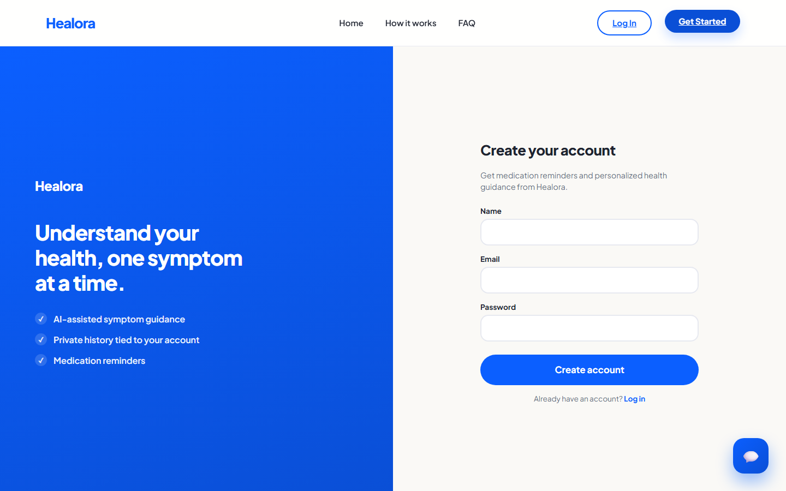
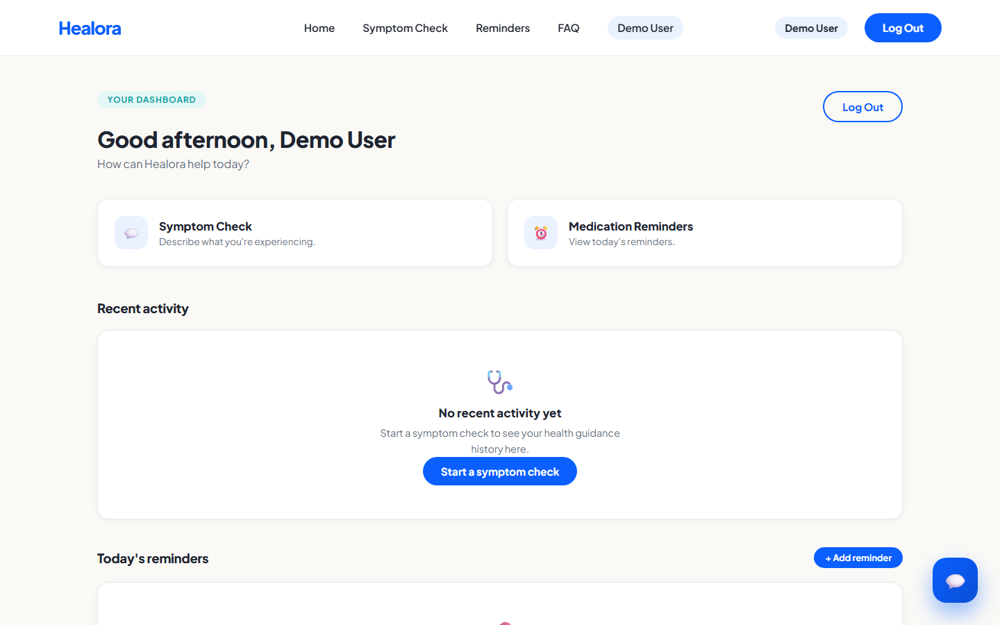
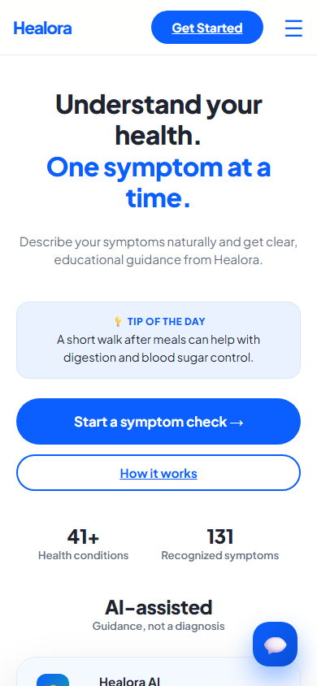
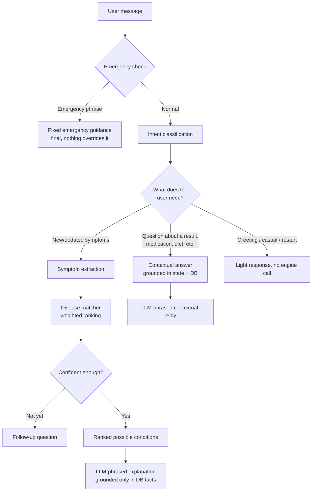

<div align="center">

# Healora

**AI-assisted symptom support for clearer, safer health guidance.**

[](frontend/package.json)
[](frontend/package.json)
[](backend/requirements.txt)
[](backend/requirements.txt)
[](backend/models.py)
[](backend/llm/gemini_provider.py)
[](backend/auth.py)
[](LICENSE)

[**Live Demo**](https://healora-six.vercel.app) · [**Backend API**](https://healora-l3nl.onrender.com) · [**Repository**](https://github.com/Chhavig02/Healora)

</div>

<br />

<div align="center">
  
</div>

<br />

> ⚠️ **Healora is an educational symptom-support application, not a medical diagnostic tool.** It never states a definitive diagnosis — results are always framed as *possible conditions to discuss with a doctor*. Always consult a licensed healthcare professional, especially for anything severe, persistent, or worsening.

---

## Table of contents

- [What is Healora?](#what-is-healora)
- [Product preview](#-product-preview)
- [Key features](#-key-features)
- [How it works](#-how-it-works)
- [Architecture](#-architecture)
- [The Gemini boundary](#-the-gemini-boundary)
- [LLM gateway](#-llm-gateway)
- [Scaling the knowledge base](#-scaling-the-knowledge-base)
- [Getting started](#-getting-started)
- [Testing](#-testing)
- [API reference](#-api-reference)
- [Deployment](#-deployment)
- [Limitations](#-limitations)
- [License](#-license)

---

## What is Healora?

Healora is a conversational health assistant, not a one-shot symptom form. It remembers what you've told it across turns, asks only the follow-up questions still needed, understands interruptions ("what medicine should I take?") without losing the thread, and switches naturally between free-form health conversation and a structured symptom assessment when there's enough to work with.

A **conversation orchestrator** decides what each message needs — casual chat, a general health question, pregnancy, a follow-up on an existing result, or a genuine symptom report — and only the last of those touches the deterministic disease-matching engine underneath. An independent **emergency check** runs before anything else, every time, and can't be overridden by the AI layer.

---

## 🖥️ Product Preview

| | |
|---|---|
| **Landing page** |  |
| **AI symptom assistant** |  |
| **Possible conditions** |  |
| **Emergency safety layer** |  |
| **Authentication** |  |
| **Dashboard & reminders** |  |
| **Mobile** |  |

*Real captures of the live deployment — no mockups.*

---

## ✨ Key Features

- **Natural-language conversation** — plain English or Hinglish ("mujhe bukhar hai"), typos tolerated, multi-turn memory, no repeated questions.
- **Intent-aware routing** — casual talk, pregnancy, general health questions, and symptom follow-ups are recognized on their own terms instead of everything being forced through the disease matcher.
- **Clause-aware negation** — "fever but no cough" correctly records one present, one denied.
- **Structured, DB-driven disease matching** — weighted symptom-overlap ranking, not a hardcoded list or a per-boot ML retrain.
- **Differential assessment, not a verdict** — positive/negative symptoms, ranked possibilities with *why*, what's still uncertain, a recommended next step — always "possible conditions to discuss with a doctor."
- **Independent emergency detection** — keyword-based, runs first, final — nothing downstream (including the AI layer) can override it.
- **Safe medication handling** — never a fabricated dosage or prescription; medication questions always get an honest, grounded answer.
- **Provider-agnostic LLM gateway** — Gemini primary, optional configurable fallback provider, deterministic floor under both — the app stays conversational even if an AI provider is down.
- **Auth, dashboard, and medication reminders** — JWT login, per-user reminders (create/edit/pause/delete), personalized chat history.
- **Responsive React 19 + Vite frontend.**

---

## 🔍 How It Works



- **Emergency detection always wins** — no DB call, no model call, nothing downstream can soften it.
- **The disease engine is invoked deliberately** — only a new/updated symptom or answering a pending assessment question reaches it. A question *about* an existing result never does.
- **Local extraction always works** — Gemini/fallback extraction is unioned with it, so the app functions with zero AI calls.
- **The matcher decides the medical result; the LLM decides the words** — which condition is presented is fully determined by the database before any model is called.

---

## 🏗️ Architecture

```
backend/
├── app.py                    Flask app factory — blueprint registration + first-boot DB seeding
├── config.py                 Env-var-driven configuration
├── models.py                 User/Reminder/ChatMessage + Disease/Symptom/DiseaseSymptom
├── auth.py, reminders.py,
│   chat.py, diseases.py      Flask blueprints — chat.py is a thin adapter over orchestrator.py
├── orchestrator.py           Conversation orchestrator — all routing/decision logic
├── conversation_state.py     Structured, stateless multi-turn conversation state
├── intent_classifier.py      Intent classification, Gemini-assisted with a deterministic fallback
├── negation.py                Clause-aware negation splitting (English + Hinglish)
├── profile_extraction.py     Age/sex/medications/allergies/conditions extraction
├── history_taking.py         Generic duration/severity/onset follow-up questions
├── disease_matcher.py        Generic, DB-driven ranking + adaptive follow-up questions
├── symptom_engine.py         Free-text → canonical symptom name matching
├── emergency.py              Independent, keyword-based emergency detection
├── llm/                      Provider-agnostic LLM gateway (Gemini + optional fallback)
│   ├── base.py                 ProviderError, shared system instruction
│   ├── gemini_provider.py      Primary provider (google-genai)
│   ├── openai_compatible_provider.py   Configurable fallback (Groq/OpenAI/Together/OpenRouter/custom)
│   └── gateway.py               Routing: primary → fallback → None
├── gemini_client.py          Backward-compatible re-export of llm.gateway
├── health_tips.py            Daily wellness tip (AI or curated fallback)
├── schema_sync.py            Additive auto-migration (adds missing nullable columns)
├── data/                     Legacy dataset + curated symptom/ambiguous-term aliases
├── scripts/                  Seed/import/verification scripts (see Scaling + Testing)
└── tests/                    196-test pytest suite

frontend/
└── src/
    ├── pages/                Home, Login, Signup, Dashboard
    ├── components/
    │   ├── ChatWidget.jsx    The symptom-check conversational UI
    │   └── ui/               ConditionCard, MessageBubble, Alert, Badge, ...
    ├── context/               Auth context (JWT persisted client-side)
    └── lib/api.js             Thin fetch wrapper around the backend API
```

<details>
<summary><strong>Disease knowledge base — schema details</strong></summary>

<br />

Relational, not a hardcoded dict: `Disease` (name, description, risk score, optional enrichment fields — `NULL` unless real data backs them), `Symptom` (canonical name + aliases), `DiseaseSymptom` (weighted many-to-many link), `SymptomAlias`/`DiseaseAlias` (conversational phrasings → canonical names). All indexed on lookup columns.

`disease_matcher.py` scores every disease sharing a confirmed symptom: `(matched_weight × 10) − (contradicted_weight × 6) − (total_weight × 0.15)`. Nothing in it references a disease by name — add rows, and it participates automatically.

`symptom_engine.py` resolves free text in three passes: exact phrase, all-significant-words-any-order, then fuzzy single-token (catches typos like "haedache").

</details>

<details>
<summary><strong>Conversation state, negation, and contextual answers</strong></summary>

<br />

`conversation_state.py` is a stateless dict (chief complaint, duration/severity/onset, confirmed/denied symptoms, volunteered profile context, conversation phase) round-tripped through the client each request — no server-side session.

`intent_classifier.py` distinguishes symptom reports from casual talk, pregnancy, medication/diet/precaution/severity/cause questions, restarts, and genuinely unclear messages — Gemini-assisted, always backed by a deterministic regex fallback. A pending question doesn't blindly consume the next message: an interruption is recognized first, answered, and the original question is gently resurfaced.

A single vague symptom mention ("I'm tired all the time") gets one open conversational turn before structured assessment starts — not immediate slot-filling. Concrete or multi-symptom reports still go straight into assessment, unchanged. General health questions ("why does fever happen?") are answered directly rather than deflected.

Post-assessment questions ("what does that mean?", "medicines?", "I'm worried") are answered by one shared contextual-answer capability, grounded in conversation state plus the matched `Disease` row's own facts — never a fresh call into the disease engine.

</details>

---

## 🤖 The Gemini Boundary

Gemini (and any fallback provider) is the language layer only — never Healora's source of medical truth. Enforced structurally:

| Rule | How it's enforced |
|---|---|
| Never writes to `Disease`/`Symptom` tables | Only `scripts/seed_diseases.py` does; no model response reaches `db.session.add()` |
| Extracted symptoms are validated | Every returned item is checked against the real `Symptom` table; unresolved ones are discarded, never inserted |
| One bad extracted term doesn't poison the rest | Filtering is per-item, not all-or-nothing |
| Can't invent negation | Only fills in a symptom the deterministic clause splitter (`negation.py`) missed — never overrides a local determination |
| Disease ranking is model-free | `disease_matcher.py` decides which condition is presented *before* any model call |
| Explanations are grounded, not generated from scratch | Prompts include the specific `Disease` row's fields and an explicit allow-list of condition names |
| Can't touch emergency | `emergency.py` runs and returns before intent classification is ever reached |
| Every call has a bounded fallback | No key, a failure, a timeout, a rate limit, or a malformed response all resolve to the same deterministic text — never an error shown to the user |

Enforced by code structure and prompt constraints, not a guarantee against every possible model deviation — see [Limitations](#-limitations).

---

## 🔌 LLM Gateway

```
Conversation Orchestrator → LLM Gateway → Gemini (primary) → Fallback provider (optional) → deterministic text
```

- **Gemini stays primary**, unchanged — same 10s-timeout, single-attempt integration as before.
- **Fallback is optional and env-var driven**, speaking the OpenAI-compatible Chat Completions API (`groq`, `openai`, `together`, `openrouter`, `fireworks`, or any custom `openai_compatible` endpoint). Omit it and the app behaves exactly as it always has.
- **Quota/rate-limit/API errors** move to the next provider immediately; a **timeout** gets one bounded retry first. Never a loop.
- The gateway only ever returns text/JSON/`None` — it has no notion of diseases or symptoms, and both providers receive the identical system instruction and grounded context.
- Failures are logged server-side (`provider_used`, `failure_reason`) — never an API key, a stack trace, or a raw error shown to the user.

```bash
# backend/.env — fallback is entirely optional
FALLBACK_LLM_PROVIDER=groq
FALLBACK_API_KEY=
FALLBACK_MODEL=              # sensible default exists per known provider
FALLBACK_BASE_URL=           # only needed for a provider not in the known list
```

---

## 📊 Scaling the Knowledge Base

Growing the dataset means **adding data, not code** — `disease_matcher.py`/`symptom_engine.py` are fully generic.

```bash
cd backend
python scripts/seed_diseases.py --json path/to/more_diseases.json
```

Idempotent (matched by unique name/link). An optional 150-disease expansion (`scripts/import_disease_expansion.py`, sourced from MedlinePlus/Columbia's Disease-Symptom Knowledge Database) is available but not run automatically — the live demo runs the base ~41-disease/131-symptom set. **This dataset is real but not clinically validated** — treat it as a starter set, not a production medical source.

---

## 🚀 Getting Started

### Backend

```bash
cd backend
python -m venv .venv
source .venv/Scripts/activate   # or .venv/bin/activate on macOS/Linux
pip install -r requirements-dev.txt
cp .env.example .env            # fill in GEMINI_API_KEY if you have one
python app.py
```

Runs on `http://localhost:5000`. No manual seed step — a fresh empty database auto-seeds on first boot. Without `GEMINI_API_KEY` (or a fallback provider) set, the app still works fully via local, zero-cost fallbacks.

### Frontend

```bash
cd frontend
npm install
cp .env.example .env   # VITE_API_URL, defaults to http://localhost:5000
npm run dev
```

Runs on `http://localhost:5173`.

Free Gemini key: [aistudio.google.com/app/apikey](https://aistudio.google.com/app/apikey) → put it in `backend/.env` as `GEMINI_API_KEY=`.

---

## 🧪 Testing

```bash
cd backend
python -m pytest tests/ -v
```

**196 tests** — symptom matching, disease ranking, the full conversation pipeline (negation, intent switching, pregnancy, casual talk, open conversation vs. assessment transitions, post-assessment follow-ups), the LLM gateway's provider routing and failure handling, emergency detection, auth, reminders, and first-boot seeding. Runs entirely offline against a temp SQLite DB — no real API calls. `backend/scripts/verify_*.py` are companion manual scripts for exercising real multi-turn flows (including a local fake fallback-provider server) against a running instance.

---

## 🔌 API Reference

| Endpoint | Method | Auth | Notes |
|---|---|---|---|
| `/api/chat` | POST | optional | `{message, answers, state}` → `{message, next_step, answers, state, emergency}`. `next_step.type` is `question`, `result`, `emergency`, `waiting`, or `reset`. A `result` includes the full differential-assessment payload (summary, matched/denied symptoms, possible conditions with reasoning, uncertain symptoms, recommended next step). |
| `/api/symptoms` | GET | — | All known symptom display names |
| `/api/diseases` | GET | — | Paginated/searchable disease list |
| `/api/diseases/<id>` | GET | — | Full disease detail |
| `/api/tips` | GET | — | Daily wellness tip |
| `/api/auth/signup` | POST | — | `{name, email, password}` → `{token, user}` |
| `/api/auth/login` | POST | — | `{email, password}` → `{token, user}` |
| `/api/auth/me` | GET | required | Current user |
| `/api/reminders` | GET/POST | required | List / create |
| `/api/reminders/<id>` | PUT/DELETE | required | Update / delete |

---

## 📦 Deployment

- **Backend**: any Python host (`Procfile` → gunicorn, threaded). Set `DATABASE_URL` to a real Postgres instance (`postgres://` is normalized automatically), `JWT_SECRET`, `GEMINI_API_KEY`, `CORS_ORIGINS`, and optionally `FALLBACK_LLM_PROVIDER`/`FALLBACK_API_KEY`. Auto-seeds on first boot against an empty database. The conversation layer adds no new tables — it's fully client-round-tripped, so it has no bearing on migrations.
- **Frontend**: static build (`npm run build`), deploy anywhere. Set `VITE_API_URL`. This project: frontend on Vercel, backend on Render with managed Postgres.

---

## ⚠️ Limitations

- Dataset is real but explicitly unvalidated — see [Scaling the knowledge base](#-scaling-the-knowledge-base).
- LLM grounding is prompt-enforced, not runtime-guaranteed — no automated post-hoc check on model output.
- No real migrations tool — `schema_sync.py` only adds nullable columns.
- Symptom aliases are hand-curated, not exhaustive (Hinglish coverage is partial).
- Negation splitting handles documented cases (clauses split on "but"/"however"/punctuation), not full sentence parsing.
- Profile-context extraction (age/sex/medications/allergies) is curated regex, not open-ended NLP.
- No dedicated "reassess my symptoms" trigger — handled as a conversational question today.
- Client-side routing on static hosts needs a rewrite rule for deep links.

---

## 📄 License

This project is open-source under the [MIT License](LICENSE).
