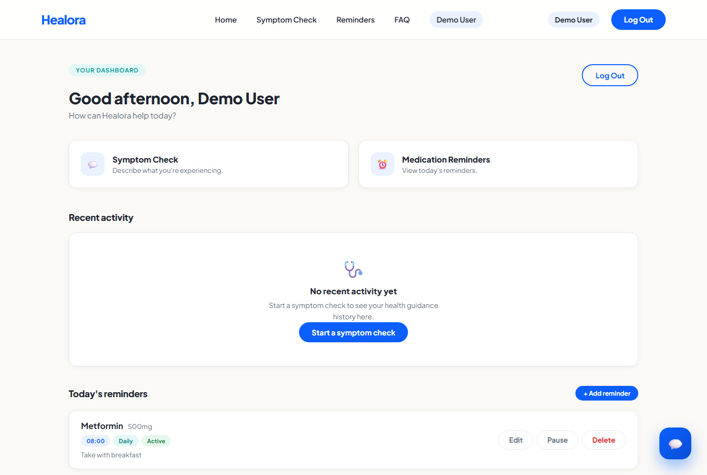
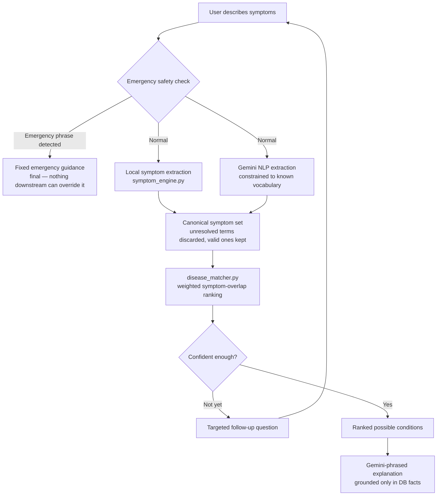

<div align="center">

# Healora

**AI-assisted symptom support for clearer, safer health guidance.**

[](frontend/package.json)
[](frontend/package.json)
[](backend/requirements.txt)
[](backend/requirements.txt)
[](backend/models.py)
[](backend/gemini_client.py)
[](backend/auth.py)
[](LICENSE)

[**Live Demo**](https://healora-six.vercel.app) · [**Backend API**](https://healora-l3nl.onrender.com) · [**Repository**](https://github.com/Chhavig02/Healora)

</div>

<br />

<div align="center">
  
</div>

<br />

> ⚠️ **Healora is an educational symptom-support application and is not a medical diagnostic tool.** It never states a definitive diagnosis — every result is framed as a *possible condition to discuss with a doctor*. Always consult a licensed healthcare professional, especially for anything severe, persistent, or worsening.

---

## Table of contents

- [What is Healora?](#what-is-healora)
- [Product preview](#-product-preview)
- [Key features](#-key-features)
- [How it works](#-how-it-works)
- [Architecture](#-architecture)
- [The Gemini boundary](#-the-gemini-boundary)
- [Emergency safety layer](#-emergency-safety-layer)
- [Scaling the knowledge base](#-scaling-the-knowledge-base)
- [Medical data quality](#-medical-data-quality)
- [Getting started](#-getting-started)
- [Testing](#-testing)
- [API reference](#-api-reference)
- [Deployment](#-deployment)
- [Limitations](#-limitations)
- [License](#-license)

---

## What is Healora?

Healora is a full-stack health-tech application that helps people put words to what they're feeling and understand what it might mean — without pretending to be a doctor.

A user describes their symptoms **in plain, natural language** ("I have a fever and headache"). Healora:

1. Normalizes that free text into known, canonical symptom names — using a fast local matcher first, with Gemini as an optional NLP layer for phrasing that the local matcher can't resolve on its own.
2. Matches the resulting symptom set against a **structured, relational disease/symptom knowledge base** (not a hardcoded list), ranking candidate conditions by weighted symptom overlap.
3. Asks a targeted follow-up question when the signal isn't strong enough yet, or presents ranked **possible conditions** — each with a qualitative match strength, never a fabricated percentage.
4. Runs every message through an **independent emergency-safety check** first, before any database lookup or model call, so a phrase like "chest pain" or "can't breathe" is never held up waiting on an AI response.
5. Wraps every explanation in **educational framing**, grounded only in facts the database actually contains — Gemini writes the prose, but never decides the medical facts.

Everything above is real, running code — described in detail (with file references) further down this document.

---

## 🖥️ Product Preview

### Landing page


### AI symptom assistant

Natural-language input, quick-start prompts, and a conversational follow-up flow.


### Possible conditions

Ranked results with match strength, matched symptoms, and other possibilities — always paired with an educational, non-diagnostic disclaimer.


### Emergency safety layer

A hardcoded, Gemini-independent check intercepts emergency phrasing before anything else runs.


### Authentication


### Dashboard & medication reminders




### Responsive / mobile


*All screenshots above are real captures of the live deployment — no mockups or stock imagery.*

---

## ✨ Key Features

- 💬 **Natural-language symptom input** — describe how you feel in your own words, no medical jargon required.
- 🧠 **Local symptom extraction** — a deterministic, three-pass matcher (`symptom_engine.py`) resolves free text to canonical symptom names using exact phrase, multi-word, and fuzzy-typo matching. Always available, zero external calls, zero cost.
- 🔤 **Symptom normalization & aliases** — conversational phrasings ("my joints hurt", "can't breathe properly") map to canonical symptom names via a curated `SymptomAlias` table.
- 🗄️ **Structured disease/symptom knowledge base** — `Disease`, `Symptom`, and `DiseaseSymptom` are database rows with weighted, many-to-many links, not a hardcoded Python dict.
- 📊 **Weighted disease matching & ranking** — `disease_matcher.py` scores every candidate disease by matched vs. contradicted symptom weight; nothing in this module is disease-specific.
- ✅ **Possible-condition results** — ranked, qualitative match strength ("possible" / "moderate" / "strong"), never a numeric confidence score.
- 🚨 **Independent emergency detection** — a fixed keyword check runs before any database query or Gemini call, and its decision is final.
- 🤖 **Gemini NLP layer** — used for symptom-name extraction, natural follow-up question phrasing, and grounded result explanations. Never the source of medical truth — see [The Gemini boundary](#-the-gemini-boundary).
- 🔁 **Graceful Gemini fallback** — every Gemini call degrades to a deterministic local fallback if no API key is configured, the call fails, or the response fails shape validation. The app is fully functional with zero AI calls.
- 🌱 **Automatic knowledge-base initialization** — on a fresh database, the app seeds itself from the bundled dataset on first boot; no manual migration step required to get a working instance.
- 🔐 **Authentication** — JWT-based email/password signup and login.
- 📋 **User dashboard** — quick actions, recent-activity surface, and reminders in one place.
- ⏰ **Medication reminders** — create, edit, pause, and delete reminders (medication, dosage, time, frequency, notes), scoped to your account.
- 🧾 **Personalized context** — a logged-in user's recent chat history is fed back into result explanations.
- 💡 **Daily wellness tip** — AI-generated when Gemini is configured, otherwise a curated static list.
- 📱 **Responsive frontend** — a React 19 + Vite single-page app that works from mobile to desktop.

---

## 🔍 How It Works



A few things worth calling out about this flow:

- **Emergency detection always wins.** It runs first, needs no database or network call, and its result can't be seen or overridden by anything downstream — including Gemini.
- **Extraction is two independent sources merged, not a pipeline.** Local keyword matching and Gemini's extraction both run against the *same* canonical vocabulary and their results are unioned — so if Gemini is down, rate-limited, or simply not configured, local matching alone still works.
- **An unresolved symptom never poisons a valid one.** If a user says "I have cold and fever" and "cold" doesn't resolve to any canonical symptom, `fever` still reaches the matcher on its own — the invalid term is dropped, not the whole extraction.
- **The matcher decides the medical result; Gemini decides the words.** Which condition is presented is fully determined by `disease_matcher.py` reading the database — Gemini is only called afterward, to phrase an explanation grounded in the facts that decision already produced.

---

## 🏗️ Architecture

```
backend/
├── app.py                    Flask app factory — blueprint registration + first-boot DB seeding
├── config.py                 Env-var-driven configuration
├── models.py                 User/Reminder/ChatMessage + Disease/Symptom/DiseaseSymptom
├── auth.py, reminders.py,
│   chat.py, diseases.py      Flask blueprints
├── disease_matcher.py        Generic, DB-driven ranking + adaptive follow-up questions
├── symptom_engine.py         Free-text → canonical symptom name matching
├── emergency.py              Independent, keyword-based emergency detection
├── gemini_client.py          Gemini wrapper + the "Gemini boundary" contract
├── health_tips.py            Daily wellness tip (AI or curated fallback)
├── schema_sync.py            Additive auto-migration (adds missing nullable columns)
├── data/                     Legacy dataset descriptions + curated symptom aliases
├── scripts/
│   ├── seed_diseases.py      Idempotent CSV/JSON → database importer
│   └── import_disease_expansion.py   Optional 150-disease dataset merge
└── tests/                    73-test pytest suite

frontend/
└── src/
    ├── pages/                Home, Login, Signup, Dashboard
    ├── components/
    │   ├── ChatWidget.jsx    The symptom-check conversational UI
    │   └── ui/               ConditionCard, MessageBubble, Alert, Badge, ...
    ├── context/               Auth context (JWT persisted client-side)
    └── lib/api.js             Thin fetch wrapper around the backend API
```

<details>
<summary><strong>The disease knowledge base — schema details</strong></summary>

<br />

Replaces an original hardcoded ~41-disease dict and a `sklearn.DecisionTreeClassifier` retrained from a CSV on every server boot.

- **`Disease`** — name, description, category, `risk_score` (0–100, drives a computed `severity_label`), plus optional enrichment fields (`causes`, `risk_factors`, `prevention`, `when_to_see_doctor`, `emergency_warning_signs`, `management`, `age_sex_notes`) and a `source` attribution. Enrichment fields are `NULL` unless there's real data behind them — never auto-filled with generated text (see [Medical data quality](#-medical-data-quality)).
- **`Symptom`** — canonical underscored name (the same identifier used in the `answers` API contract), display name, optional category.
- **`DiseaseSymptom`** — the many-to-many link, with `is_common` and a continuous `weight` so a defining symptom counts for more than an occasional one. Unique-constrained on `(disease_id, symptom_id)`.
- **`SymptomAlias` / `DiseaseAlias`** — conversational phrasings mapped to a canonical name (`"my joints hurt"` → `joint_pain`), and disease name variants, respectively.

All four tables are indexed on their name columns and the foreign keys used for lookups, so ranking queries stay targeted instead of scanning every disease.

### `disease_matcher.py` — generic ranking, no per-disease logic

`rank_diseases(yes_symptoms, no_symptoms)` scores every disease sharing at least one confirmed symptom: `(matched_weight × 10) − (contradicted_weight × 6) − (total_weight × 0.15)`, ranked descending. `get_next_step(answers)` decides whether to ask another question or present a result — a result requires the top candidate to clear a score threshold *and* have at least 2 corroborating symptoms (not just one high-weight match), or the user has volunteered 4+ symptoms, or a question budget is exhausted. Nothing in this file references a disease by name — add a disease to the database and it participates automatically.

### `symptom_engine.py` — free text → canonical symptom names

Three passes, in order, all backed by the `Symptom`/`SymptomAlias` tables (no hardcoded vocabulary):

1. **Exact phrase match** — canonical name, display name, or a known alias appears verbatim (word-bounded) in the message.
2. **All-significant-words match** — every non-stopword of a multi-word symptom/alias appears somewhere in the message, in any order.
3. **Fuzzy single-token match** (`difflib`, cutoff 0.84) — catches typos like "haedache", only attempted if the first two passes found nothing.

</details>

---

## 🤖 The Gemini Boundary

Gemini is the language layer only — it is never Healora's source of medical truth. This is enforced structurally, not just by prompt wording:

| Rule | How it's enforced |
|---|---|
| Gemini never creates/edits a `Disease` or `Symptom` row | Only `scripts/seed_diseases.py` writes to those tables; no code path lets a Gemini response reach `db.session.add()` |
| Symptom names Gemini extracts are validated | `chat.py`'s `_gemini_extract_symptoms` filters every returned item against the real `Symptom` table; unresolved items are discarded and logged, never inserted |
| An unresolved symptom can't discard a valid one | Extraction is a per-item filter, not an all-or-nothing check — one bad term never drops the good ones alongside it |
| Disease ranking is Gemini-free | `disease_matcher.py` only reads the database; which disease is presented is decided *before* Gemini is ever called |
| Explanations are grounded, not generated from scratch | The result-explanation prompt includes the specific `Disease` row's fields and explicitly lists the only condition names Gemini is allowed to mention |
| Emergency detection is fully independent | `emergency.py` has no Gemini dependency and runs before any database lookup or model call; its decision is final |
| JSON responses are shape-validated | `gemini_client.generate_json` accepts a `validator` callable; a shape mismatch is treated exactly like an API failure |
| Every Gemini call has a bounded fallback | No API key, a failed call, a timeout, or a bad response all resolve to the same deterministic local fallback — never an error shown to the user |

This is enforced by code structure and prompt constraints, not a guarantee against every possible model deviation — see [Limitations](#-limitations).

---

## 🚨 Emergency Safety Layer

`emergency.py` checks the raw message against a hardcoded phrase list (chest pain, can't breathe, loss of consciousness, stroke-like symptoms, suicidal ideation, uncontrolled bleeding, anaphylaxis, and more) **before** anything else in the request — before symptom extraction, before any database query, before any Gemini call. If it matches, the response is a fixed, concise safety message directing the user to emergency services; nothing else in the pipeline runs, and nothing downstream can override that decision.

---

## 📊 Scaling the Knowledge Base

<details>
<summary><strong>Adding diseases without touching source code</strong></summary>

<br />

Going from the current dataset to hundreds more diseases requires **adding data, not changing code** — `disease_matcher.py` and `symptom_engine.py` are fully generic.

```bash
cd backend
python scripts/seed_diseases.py --json path/to/more_diseases.json
```

```json
[
  {
    "name": "Dengue",
    "description": "...",
    "category": "Infectious disease",
    "risk_score": 65,
    "source": "https://www.who.int/news-room/fact-sheets/detail/dengue-and-severe-dengue",
    "symptoms": [
      { "name": "high_fever", "is_common": true, "weight": 2.5 },
      { "name": "headache", "is_common": true, "weight": 2.0 }
    ]
  }
]
```

The importer is **idempotent** — diseases and symptoms are matched by unique name, links by a `(disease_id, symptom_id)` unique constraint. Re-running the same file updates existing rows rather than duplicating them.

### The optional 150-disease expansion

`scripts/import_disease_expansion.py` can merge a second, larger dataset — 150 additional diseases, 360 additional symptoms, 750 disease-symptom mappings, sourced from `backend/data/expansion/*.xlsx` — into the same tables:

```bash
python scripts/import_disease_expansion.py
```

Also idempotent, and specifically careful about not blindly merging similarly-named records — see `DISEASE_MERGE_MAP` / `SYMPTOM_MERGE_MAP` in that script for the hand-reviewed list of genuine duplicates versus medically-distinct look-alikes kept separate on purpose (e.g. `eye_pain` is not `knee_pain`).

This expansion is **not** run automatically — the live demo above runs on the base ~41-disease / 131-symptom dataset, seeded automatically on first boot (see [Deployment](#-deployment)).

</details>

---

## 🧪 Medical Data Quality

<details>
<summary><strong>Data provenance, quality notes, and known dirty-data findings</strong></summary>

<br />

The bundled migration ports the project's original dataset faithfully — nothing was invented to pad it out, and nothing was dropped:

- **Disease/symptom associations** come from per-disease symptom *frequency* across the dataset's training rows, so a symptom present in only some of a disease's rows is distinguishable from one present in all of them.
- **Enrichment fields** (`causes`, `prevention`, `when_to_see_doctor`, etc.) are left `NULL` for the migrated data — there was no real source for them in the original project, and generating plausible-sounding text would be exactly the kind of fabrication this schema exists to avoid.
- **Every migrated disease has a `source`** field crediting the original dataset, not a fabricated citation.
- **This app does not fabricate large disease datasets from scratch.** The optional 150-disease expansion is real curated data with citations (MedlinePlus, Columbia's Disease-Symptom Knowledge Database) — not generated filler — and every record in it carries its own `verification_status` of *"Needs source-backed enrichment/clinical review before production."*

**Do not present this dataset as clinically validated.** The architecture scales to hundreds of diseases; the data is a real but explicitly-unvalidated starter set for a meaningful fraction of it.

### Dirty-data findings (found and fixed during migration)

- The source CSV's header lists one symptom column **twice** — an upstream duplication, correctly collapsed to a single `Symptom` row with its disease links unioned, so the true unique symptom count is 131, not 132.
- The raw CSV and the original curated-description dict had inconsistent trailing whitespace on disease names (`"Hypertension "`, `"Diabetes "`) that would have silently produced a `NULL` description without normalization — fixed by stripping both sides before matching.
- The optional expansion dataset overlaps the base dataset on a few diseases under different casing or a dataset typo (`"Osteoarthristis"` vs. the correct `"Osteoarthritis"`) — all merged into the existing row (with the correct spelling preserved as an alias) rather than duplicated.

</details>

---

## ⚡ Performance

Ranking queries filter by `symptom_id IN (...)` against indexed columns rather than iterating every disease, and the app does not train a model from a CSV at every boot. The symptom vocabulary used for Gemini-constrained extraction is cached in-process after first load.

---

## 🚀 Getting Started

### Backend

```bash
cd backend
python -m venv .venv
source .venv/Scripts/activate   # or .venv/bin/activate on macOS/Linux
pip install -r requirements-dev.txt   # includes pytest; use requirements.txt for prod-only
cp .env.example .env            # then fill in GEMINI_API_KEY if you have one
python app.py
```

Runs on `http://localhost:5000`. **No manual seed step needed** — on a fresh, empty database, `create_app()` automatically seeds the knowledge base from the bundled dataset on first boot. Without `GEMINI_API_KEY` set, the app still works fully — symptom extraction and phrasing just fall back to the local, zero-cost logic.

### Frontend

```bash
cd frontend
npm install
cp .env.example .env   # VITE_API_URL, defaults to http://localhost:5000
npm run dev
```

Runs on `http://localhost:5173`.

### Getting a free Gemini API key

1. Go to [aistudio.google.com/app/apikey](https://aistudio.google.com/app/apikey)
2. Create a key (free tier, rate-limited)
3. Put it in `backend/.env` as `GEMINI_API_KEY=...`

---

## 🧪 Testing

```bash
cd backend
python -m pytest tests/ -v
```

**73 tests**, covering symptom matching/aliasing, disease ranking, the full `/api/chat` pipeline, emergency detection, authentication, reminders, the disease-expansion importer, and first-boot auto-seeding. Runs entirely offline against a temporary SQLite database — no real Gemini API calls are made (several tests monkeypatch `gemini_client` to simulate a failing call and assert the fallback still works correctly).

---

## 🔌 API Reference

| Endpoint | Method | Auth | Notes |
|---|---|---|---|
| `/api/chat` | POST | optional | `{message, answers}` → `{message, next_step, answers, emergency}`. `answers` is `[[symptom_name, bool], ...]`. `next_step.type` is `question`, `result`, `emergency`, `waiting`, or `reset`. |
| `/api/symptoms` | GET | — | All known symptom display names |
| `/api/diseases` | GET | — | Paginated/searchable disease list (`?q=`, `?page=`, `?page_size=`) |
| `/api/diseases/<id>` | GET | — | Full disease detail including its symptom links |
| `/api/tips` | GET | — | Daily wellness tip |
| `/api/auth/signup` | POST | — | `{name, email, password}` → `{token, user}` |
| `/api/auth/login` | POST | — | `{email, password}` → `{token, user}` |
| `/api/auth/me` | GET | required | Current user |
| `/api/reminders` | GET/POST | required | List / create |
| `/api/reminders/<id>` | PUT/DELETE | required | Update / delete |

---

## 📦 Deployment

- **Backend**: any Python host works (`Procfile` runs `gunicorn --workers 2 --threads 4 --timeout 30 app:app` — threaded so a slow Gemini call can't block unrelated requests). Set `DATABASE_URL` to a real Postgres instance — most free hosts reset the local filesystem on every deploy, which would wipe a SQLite file. The app **auto-seeds the base knowledge base on first boot** against an empty database; run `python scripts/import_disease_expansion.py` afterward if you also want the optional 150-disease expansion. Also set `JWT_SECRET`, `GEMINI_API_KEY`, and `CORS_ORIGINS` (comma-separated list of your frontend's origin(s)).
- **Frontend**: static build (`npm run build`) deploys anywhere (Vercel, Netlify, etc.). Set `VITE_API_URL` to your deployed backend's URL. This project's frontend is deployed on Vercel; the backend on Render.

---

## ⚠️ Limitations

- **A real but explicitly-unvalidated dataset.** The architecture scales to hundreds of diseases; a meaningful fraction of the optional expansion data needs clinical review before it should be treated as validated — see [Medical data quality](#-medical-data-quality).
- **Gemini grounding is prompt-enforced, not runtime-guaranteed.** The explanation prompt explicitly lists the only condition names Gemini may mention, but an LLM can still occasionally deviate from instructions — there's no automated post-hoc check that its prose never names anything outside that list.
- **No real database migrations tool.** `schema_sync.py` auto-adds missing *nullable* columns to an existing table, but it can't alter or rename an existing column, backfill a `NOT NULL` addition, or drop anything. Introducing Alembic is a reasonable next step before the schema needs a non-additive change.
- **Symptom aliases are hand-curated, not exhaustive.** A subset of the base symptom set has conversational aliases seeded; symptoms added by the optional expansion have none yet beyond their own display name.
- **Client-side routing on static hosts needs a rewrite rule.** As a React Router SPA, deep links (e.g. `/signup` loaded directly, not navigated to from within the app) require the host to rewrite unmatched paths to `index.html` — otherwise a direct load 404s while in-app navigation still works fine.

---

## 📄 License

This project is open-source under the [MIT License](LICENSE).
